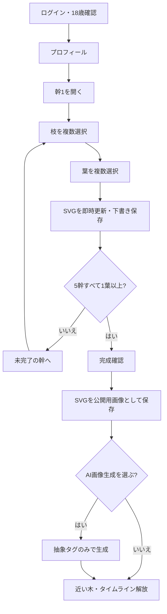
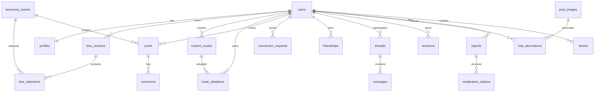

# Tree of Life（TOF）要件定義書・基本設計書

| 項目 | 内容 |
| --- | --- |
| 文書名 | Tree of Life（TOF）要件定義書兼基本設計書 |
| 文書区分 | **次期実装の正本（To-Be仕様）** |
| バージョン | 0.4.3（C案・未来の生命体UI採用） |
| 更新日 | 2026/03/27 |
| 公開リポジトリ | https://github.com/Oliver19996/tree-of-life |
| 想定読者 | プロダクト、UI/UX、VSCode/Cursor等を用いる実装担当者 |

> 本書は添付時点の0.2.0を置き換える次期要件である。0.4.3では固定350項目と初回3分の段階的オンボーディングを維持し、UI候補C「未来の生命体」を正式採用する。白と緑を基調に、有機的な発光表現と軽量なチップUIを組み合わせる。自由ルート、投稿画像を木に飾るUI、共感による段階成長も維持する。現行コードと衝突する場合は本書を優先する。既存DBは直接上書きせず、マイグレーションを作成すること。

---

## 1. プロダクトの目的

### 1.1 コンセプト

ユーザーが人生経験を「幹・枝・葉」から複数選択すると、選ぶたびに一本の木が育つ。完成した木を介して、同じ・近い境遇の人と安全につながり、経験を共有・相談できる18歳以上限定のSNS。

### 1.2 提供価値

- 検索語にしにくい経験でも、閉じた選択肢から見つけられる
- 選択内容そのものは原則非公開とし、他人には完成した木の画像だけを見せる
- 負の経験を「暗い木」「醜い木」に変換しない。すべての経験を複雑さ・多様性・美しさとして表現する
- 同じ葉を選んだ人だけの限定タイムラインで、投稿・画像共有・相談ができる
- 木は診断結果、人格評価、幸福度、病状を示すものではない

### 1.3 対象と禁止事項

| 項目 | 方針 |
| --- | --- |
| 年齢 | 18歳以上。登録時に生年月日入力または18歳以上の確認を必須化 |
| 言語 | MVPは日本語 |
| 用途 | 当事者同士の経験共有・相談。医療、法律、緊急支援の代替ではない |
| 禁止 | 未成年利用、出会い・勧誘目的、差別、脅迫、個人情報晒し、自傷等の助長、違法行為 |
| センシティブ項目 | 病気、障害、依存傾向、喪失、いじめ、ハラスメント等は扱う。自傷、性的被害、具体的虐待・犯罪被害はMVPの選択肢から除外 |

---

## 2. MVPスコープ

### 2.1 In

1. メールマジックリンク／Google OAuth／開発環境のみのデモログイン
2. 18歳以上確認とプロフィール
3. 固定の幹5カテゴリ、各幹の枝7カテゴリ、各枝の葉10項目（計350葉）
4. 枝・葉の複数選択。5幹すべてで1つ以上の葉を選ぶまで完成扱いにしない
5. 選択・解除のたびに木を段階描画し、自動保存
6. ルールベースSVGと、設定時に利用できる外部AI画像生成の両対応
7. 非公開の選択集合による類似ユーザー推薦
8. 木画像だけを表示する発見画面、友達申請、承認・拒否、友達一覧、1対1メッセージ
9. 同一の葉を選択したユーザーだけが閲覧・投稿できる要素別タイムライン
10. テキスト・画像投稿、コメント、通報、ブロック、管理者モデレーション
11. 幹・枝・葉を各1件ずつ自由記述する「自由ルート」の作成、自動安全検査、検索・複製
12. タイムライン投稿画像から代表12枚を選び、木の葉に重ねて飾る「メモリーフルーツ」UI
13. 投稿・画像、自由ルート、完成した木への「共感」と、非公開の累計共感による5段階の木の成長

### 2.2 Out（MVPでは作らない）

- 一般公開タイムライン、フォロー、公開いいね数、共感ランキング
- 選択した幹・枝・葉の他ユーザーへの直接開示
- 未成年向け機能、位置情報共有、予約・決済、有料プラン、ネイティブアプリ
- 医療診断、心理診断、治療助言、緊急相談の自動対応
- 自傷、性的被害、具体的虐待・犯罪被害をテーマにした専用タイムライン

---

## 3. 用語と選択ルール

| 用語 | 定義 |
| --- | --- |
| 幹（trunk） | 人生を網羅する固定5カテゴリ。ユーザーが幹自体を追加・削除しない |
| 枝（branch） | 幹の中の領域。各幹7個。複数選択可 |
| 葉（leaf） | 具体的な経験。各枝10個。複数選択可。タイムラインのアクセス単位 |
| 選択パス | `trunk_id + branch_id + leaf_id`。全350通り |
| 木 | 選択集合を不可逆な視覚パラメータに変換して描くアート表現 |
| 完成 | 5幹すべてで1つ以上の葉が選ばれ、木生成に同意した状態 |
| 近い人 | 非公開の選択集合に基づき、ブロック等を除外して推薦された他ユーザー |
| 固定ルート | 運営が提供する350件の `幹→枝→葉` パス |
| 自由ルート | ユーザーが幹・枝・葉を各1件ずつ自由記述して作る追加パス。固定5幹の完成条件には算入しない |
| 原典ルート | 自由ルートの最初の公開レコード。複製後もコミュニティ識別子として保持する |
| ルート複製 | 他人の自由ルートを自分の木へ追加する操作。文言は編集せず、原典コミュニティに参加する |
| 共感 | 投稿・画像、自由ルート、完成木へ1ユーザー1回付けられる肯定的リアクション |
| メモリーフルーツ | 本人が選んだ投稿画像を、木の葉に重ねて飾る最大12枚の画像UI |

### 3.1 必須条件

- 幹は5カテゴリすべて表示し、各幹で少なくとも1つの葉選択を必須とする（最小5葉）。
- 同じ幹内で複数の枝を選べる。同じ枝内で複数の葉を選べる。
- 枝は配下の葉が1件以上選択されている場合に選択済みとみなす。
- 選択上限はMVPでは全350件。ただし誤操作防止の確認と検索・絞り込みを用意する。
- 葉の解除で当該枝が0件になれば枝も未選択になる。
- 5幹の条件を満たさない状態では下書き保存はできるが、発見・友達申請・タイムライン利用はできない。
- 自由ルートは固定5幹の完成後に追加できる。自由ルートを何件作成・複製しても、固定5幹の必須条件の代替にはならない。

---

## 4. 350件の初期マスタ

### 4.1 マスタ共通属性

各葉は次の属性を持つ。表示文言と画像用タグを分離し、外部AIへセンシティブな日本語本文を送らない。

| 属性 | 例／用途 |
| --- | --- |
| `trunk_id`, `branch_id`, `leaf_id` | `T01`, `T01-B01`, `T01-B01-L01` |
| `label_short_ja` | 選択カード・タブ用の短い表示名。原則6〜12文字、最大14文字を目標とする |
| `description_ja` | 意味を限定する詳細説明。選択肢の補足、検索、アクセシビリティに使用 |
| `search_terms_ja` | 同義語・関連語。表示名の短文化で検索性を落とさないために使用 |
| `sensitivity` | `normal` / `caution`。cautionは初回表示前に注意文 |
| `timeline_enabled` | MVP除外テーマを誤って開放しないためのフラグ |
| `visual_seed` | ランダムではなく再現可能な抽象シード |
| `visual_tags` | 色、樹形、花、実、年輪、光、季節等。意味の逆引きができない抽象タグ |
| `active`, `version` | 廃止・改版管理。既存投稿参照のため物理削除しない |

### 4.2 初期選択肢一覧

#### T01 家族と生育環境

**T01-B01 母・母的養育者**

| ID | 短い表示名 | 詳細説明 |
| --- | --- | --- |
| T01-B01-L01 | 姉・友人のようだった | 幼少期に姉や友人のような存在だった |
| T01-B01-L02 | 安心して甘えられた | 安心して甘えられる相手だった |
| T01-B01-L03 | 期待に応えすぎた | 期待に応えようと無理をした |
| T01-B01-L04 | 進路に強い影響 | 考え方や進路に強い影響を受けた |
| T01-B01-L05 | 距離が近すぎる | 距離が近すぎると感じていた |
| T01-B01-L06 | 話を聞いてもらえなかった | 十分に話を聞いてもらえなかった |
| T01-B01-L07 | 離れて暮らす期間が長かった | 離れて暮らす期間が長かった |
| T01-B01-L08 | 病気や不調を支えた経験 ⚠ | 病気や不調を支えた経験がある |
| T01-B01-L09 | 関係を見直した | 大人になって関係を見直した |
| T01-B01-L10 | 感謝とわだかまり | 感謝とわだかまりの両方がある |

**T01-B02 父・父的養育者**

| ID | 短い表示名 | 詳細説明 |
| --- | --- | --- |
| T01-B02-L01 | 遊びや挑戦を教えてくれた | 遊びや挑戦を教えてくれた |
| T01-B02-L02 | 尊敬して背中を追った | 尊敬する背中を追ってきた |
| T01-B02-L03 | 認められるため努力 | 認めてもらうため努力した |
| T01-B02-L04 | 会話が少なく距離を感じた | 会話が少なく距離を感じた |
| T01-B02-L05 | 厳しさや威圧感に緊張した ⚠ | 厳しさや威圧感に緊張した |
| T01-B02-L06 | 不在が多かった | 仕事などで不在が多かった |
| T01-B02-L07 | 価値観の違いに悩んだ | 価値観の違いに悩んだ |
| T01-B02-L08 | 病気や不調を支えた経験 ⚠ | 病気や不調を支えた経験がある |
| T01-B02-L09 | 対話が増えた | 大人になって対話が増えた |
| T01-B02-L10 | 感謝とわだかまり | 感謝とわだかまりの両方がある |

**T01-B03 きょうだい**

| ID | 短い表示名 | 詳細説明 |
| --- | --- | --- |
| T01-B03-L01 | 姉や兄を頼りに育った | 姉や兄を頼りに育った |
| T01-B03-L02 | 弟や妹を守る役割だった | 弟や妹を守る役割だった |
| T01-B03-L03 | 何でも話せる関係だった | 何でも話せる関係だった |
| T01-B03-L04 | 比較されることがつらかった | 比較されることがつらかった |
| T01-B03-L05 | 競争や嫉妬を感じていた | 競争や嫉妬を感じていた |
| T01-B03-L06 | 年齢差で交流が少ない | 年齢差が大きく交流が少なかった |
| T01-B03-L07 | 離別や疎遠を経験 | 離別や疎遠を経験した |
| T01-B03-L08 | 家族事情を共に背負った | 家族の事情を一緒に背負った |
| T01-B03-L09 | 関係が近づいた | 大人になって関係が近づいた |
| T01-B03-L10 | 一人っ子として育った | 一人っ子として育った |

**T01-B04 祖父母・親族**

| ID | 短い表示名 | 詳細説明 |
| --- | --- | --- |
| T01-B04-L01 | 祖父母に育ててもらった時期 | 祖父母に育ててもらった時期がある |
| T01-B04-L02 | 親族の家を安心できる場所 | 親族の家を安心できる場所と感じた |
| T01-B04-L03 | 世代の知恵を受け継いだ | 世代を超えた知恵や習慣を受け継いだ |
| T01-B04-L04 | 親族の期待や干渉が重かった | 親族の期待や干渉が重かった |
| T01-B04-L05 | 親族間の対立に巻き込まれた | 親族間の対立に巻き込まれた |
| T01-B04-L06 | 冠婚葬祭で絆を実感 | 冠婚葬祭で家族のつながりを実感した |
| T01-B04-L07 | 介護や看病に関わった | 介護や看病に関わった |
| T01-B04-L08 | 死別を通じて価値観が変わった ⚠ | 死別を通じて価値観が変わった |
| T01-B04-L09 | 遠方で交流が限られていた | 遠方で交流が限られていた |
| T01-B04-L10 | 血縁外の選んだ家族 | 血縁以外の人を家族のように感じた |

**T01-B05 家庭の雰囲気**

| ID | 短い表示名 | 詳細説明 |
| --- | --- | --- |
| T01-B05-L01 | 会話や笑いの多い家庭だった | 会話や笑いの多い家庭だった |
| T01-B05-L02 | 静かで落ち着く家庭だった | 静かで落ち着く家庭だった |
| T01-B05-L03 | ルールやしつけが厳しかった | ルールやしつけが厳しかった |
| T01-B05-L04 | 家族の顔色を読む多かった | 家族の顔色を読むことが多かった |
| T01-B05-L05 | 口論や緊張が絶えなかった ⚠ | 口論や緊張が絶えなかった |
| T01-B05-L06 | 家事や世話を早くから担った | 家事や世話を早くから担った |
| T01-B05-L07 | 転勤や引っ越しが多かった | 転勤や引っ越しが多かった |
| T01-B05-L08 | 経済状況の変化を経験 | 経済状況の変化を経験した |
| T01-B05-L09 | 家族の秘密を抱えていた | 家族の秘密を抱えていた |
| T01-B05-L10 | 安心できる家庭像を作り直 | 自分で安心できる家庭像を作り直している |

**T01-B06 文化・出自・ルーツ**

| ID | 短い表示名 | 詳細説明 |
| --- | --- | --- |
| T01-B06-L01 | 地域の伝統や祭りに親しんだ | 地域の伝統や祭りに親しんだ |
| T01-B06-L02 | 家業や家の役割を受け継いだ | 家業や家の役割を受け継いだ |
| T01-B06-L03 | 複数の文化の間で育った | 複数の文化の間で育った |
| T01-B06-L04 | 方言や出身地を誇りに思う | 方言や出身地を誇りに思う |
| T01-B06-L05 | 出自を説明しづらい | 出自を説明しづらいと感じた |
| T01-B06-L06 | 周囲との文化差に戸惑った | 周囲との文化差に戸惑った |
| T01-B06-L07 | ルーツを後から調べ開始 | ルーツを後から調べ始めた |
| T01-B06-L08 | 移住や帰国で居場所が変わった | 移住や帰国で居場所が変わった |
| T01-B06-L09 | 家族の信仰に影響された | 家族の信仰や習慣に影響を受けた |
| T01-B06-L10 | 自分なりのルーツを構築 | 自分なりのルーツの捉え方を築いた |

**T01-B07 パートナー・自分の家庭**

| ID | 短い表示名 | 詳細説明 |
| --- | --- | --- |
| T01-B07-L01 | 安心本音を話せる関係を築いた | 安心して本音を話せる関係を築いた |
| T01-B07-L02 | 恋愛や結婚で新しい家族を得た | 恋愛や結婚で新しい家族を得た |
| T01-B07-L03 | 生活習慣の違いを調整 | 生活習慣の違いを調整してきた |
| T01-B07-L04 | 家事や育児の分担に悩んだ | 家事や育児の分担に悩んだ |
| T01-B07-L05 | 別居や離婚を経験 ⚠ | 別居や離婚を経験した |
| T01-B07-L06 | 子どもを持つかどうか考えた | 子どもを持つかどうか考えた |
| T01-B07-L07 | 子育てで幼少期を再考 | 子育てを通じて自分の幼少期を見直した |
| T01-B07-L08 | 義家族との距離感に悩んだ | 義家族との距離感に悩んだ |
| T01-B07-L09 | ひとりで家庭を支えてきた | ひとりで家庭を支えてきた |
| T01-B07-L10 | 血縁に限らない家族 | 血縁や婚姻に限らない家族を選んだ |

#### T02 学びと教育

**T02-B01 幼児期・保育**

| ID | 短い表示名 | 詳細説明 |
| --- | --- | --- |
| T02-B01-L01 | 遊びや創作に夢中だった | 遊びや創作に夢中だった |
| T02-B01-L02 | 先生に見守られて安心した | 先生に見守られて安心した |
| T02-B01-L03 | 集団生活になじめない | 集団生活になじむのが難しかった |
| T02-B01-L04 | 親と離れることが不安だった | 親と離れることが不安だった |
| T02-B01-L05 | 早くから得意なことがあった | 早くから得意なことがあった |
| T02-B01-L06 | 言葉や発達の違いを意識した | 言葉や発達の違いを意識した |
| T02-B01-L07 | 転園や環境の変化を経験 | 転園や環境の変化を経験した |
| T02-B01-L08 | 友だちとの初衝突 | 友だちとの初めての衝突を覚えている |
| T02-B01-L09 | 行事で達成感を味わった | 行事で達成感を味わった |
| T02-B01-L10 | 幼少期の記憶があまりない | 幼少期の記憶があまりない |

**T02-B02 小学校**

| ID | 短い表示名 | 詳細説明 |
| --- | --- | --- |
| T02-B02-L01 | 好きな教科との出会い | 好きな教科に出会った |
| T02-B02-L02 | 先生の言葉に励まされた | 先生の言葉に励まされた |
| T02-B02-L03 | 友だちと夢中で遊んだ | 友だちと夢中で遊んだ |
| T02-B02-L04 | いじめを受けていた ⚠ | いじめを受けていた |
| T02-B02-L05 | いじめを見て動けなかった ⚠ | いじめや孤立を見て動けなかった |
| T02-B02-L06 | 勉強いくのが難しかった | 勉強についていくのが難しかった |
| T02-B02-L07 | 成績への期待が重かった | 成績への期待が重かった |
| T02-B02-L08 | 転校や不登校を経験 ⚠ | 転校や不登校を経験した |
| T02-B02-L09 | 係や行事で役割を得た | 係や行事で役割を得た |
| T02-B02-L10 | 放課後の居場所に救われた | 放課後の居場所に救われた |

**T02-B03 中学校**

| ID | 短い表示名 | 詳細説明 |
| --- | --- | --- |
| T02-B03-L01 | 部活動に打ち込んだ | 部活動に打ち込んだ |
| T02-B03-L02 | 親友と呼べる人との出会い | 親友と呼べる人に出会った |
| T02-B03-L03 | 進路を意識開始 | 進路を意識し始めた |
| T02-B03-L04 | 人間関係の変化に疲れた | 人間関係の変化に疲れた |
| T02-B03-L05 | いじめや仲間外れを経験 ⚠ | いじめや仲間外れを経験した |
| T02-B03-L06 | 学校に行けない時期 | 学校に行けない時期があった |
| T02-B03-L07 | 成績や受験に強い不安があった | 成績や受験に強い不安があった |
| T02-B03-L08 | 自分の外見を気に開始 | 自分の外見を気にし始めた |
| T02-B03-L09 | 先生や先輩に支えられた | 先生や先輩に支えられた |
| T02-B03-L10 | 学校外の活動に居場所を発見 | 学校外の活動に居場所を見つけた |

**T02-B04 高校・高専**

| ID | 短い表示名 | 詳細説明 |
| --- | --- | --- |
| T02-B04-L01 | 専門的に学びたい分野を発見 | 専門的に学びたい分野を見つけた |
| T02-B04-L02 | 部活や文化祭で仲間と達成した | 部活や文化祭で仲間と達成した |
| T02-B04-L03 | 受験や進路選択に迷った | 受験や進路選択に迷った |
| T02-B04-L04 | 校風や集団になじめなかった | 校風や集団になじめなかった |
| T02-B04-L05 | 中退・転校・通信制 ⚠ | 中退や転校、通信制への変更を経験した |
| T02-B04-L06 | アルバイトと学業を両立した | アルバイトと学業を両立した |
| T02-B04-L07 | 家庭事情が学びに影響した | 家庭事情が学びに影響した |
| T02-B04-L08 | 恋愛や友情を通じて成長した | 恋愛や友情を通じて成長した |
| T02-B04-L09 | 失敗から学び方を変えた | 失敗から学び方を変えた |
| T02-B04-L10 | 卒業後も続くつながりができた | 卒業後も続くつながりができた |

**T02-B05 大学・専門教育**

| ID | 短い表示名 | 詳細説明 |
| --- | --- | --- |
| T02-B05-L01 | 学びたいテーマを深く追究した | 学びたいテーマを深く追究した |
| T02-B05-L02 | 異なる価値観の人との出会い | 異なる価値観の人に出会った |
| T02-B05-L03 | 一人暮らしで自立を学んだ | 一人暮らしで自立を学んだ |
| T02-B05-L04 | 専攻が自分に合わない | 専攻が自分に合わないと感じた |
| T02-B05-L05 | 単位や卒業に苦労した | 単位や卒業に苦労した |
| T02-B05-L06 | 休学や退学を経験 ⚠ | 休学や退学を経験した |
| T02-B05-L07 | 奨学金や学費の負担を抱えた | 奨学金や学費の負担を抱えた |
| T02-B05-L08 | 留学で視野が広がった | 留学や海外経験で視野が広がった |
| T02-B05-L09 | 研究室や実習の関係に悩んだ | 研究室や実習の関係に悩んだ |
| T02-B05-L10 | 学外活動で道を発見 | 学外活動やインターンで道を見つけた |

**T02-B06 学び直し・資格**

| ID | 短い表示名 | 詳細説明 |
| --- | --- | --- |
| T02-B06-L01 | 学び直した | 社会人になって学び直した |
| T02-B06-L02 | 資格取得が自信につながった | 資格取得が自信につながった |
| T02-B06-L03 | 独学で新しい技能を身につけた | 独学で新しい技能を身につけた |
| T02-B06-L04 | 仕事と勉強の両立に苦労した | 仕事と勉強の両立に苦労した |
| T02-B06-L05 | 試験の不合格を何度も経験 | 試験の不合格を何度も経験した |
| T02-B06-L06 | オンライン学習で機会を得た | オンライン学習で機会を得た |
| T02-B06-L07 | 年齢を気にして一歩を迷った | 年齢を気にして一歩を迷った |
| T02-B06-L08 | 学び直しで転職・復職 | 学び直しで転職や復職につながった |
| T02-B06-L09 | 必要に迫られ未知を学んだ | 必要に迫られて未知の分野を学んだ |
| T02-B06-L10 | 学ぶこと自体を楽しめる | 学ぶこと自体を楽しめるようになった |

**T02-B07 学び方・個性**

| ID | 短い表示名 | 詳細説明 |
| --- | --- | --- |
| T02-B07-L01 | 読書から多くを学んだ | 読書から多くを学んだ |
| T02-B07-L02 | 手を動かすと理解しやすい | 手を動かすと理解しやすい |
| T02-B07-L03 | 人に教えることで理解が深まる | 人に教えることで理解が深まる |
| T02-B07-L04 | 集中の波が大きい | 集中の波が大きいと感じる |
| T02-B07-L05 | 読み書きや計算に苦手さがある | 読み書きや計算に苦手さがある |
| T02-B07-L06 | 集団授業よりペースが合う | 集団授業より自分のペースが合う |
| T02-B07-L07 | 失敗を恐れて質問できなかった | 失敗を恐れて質問できなかった |
| T02-B07-L08 | 競争より協力する学びが合う | 競争より協力する学びが合う |
| T02-B07-L09 | 得意不得意の差が大きい | 得意不得意の差が大きい |
| T02-B07-L10 | 合う学び方を発見 | 自分に合う学び方を後から見つけた |

#### T03 仕事と経済

**T03-B01 初めての仕事**

| ID | 短い表示名 | 詳細説明 |
| --- | --- | --- |
| T03-B01-L01 | 初収入を得て自信がついた | 初めて収入を得て自信がついた |
| T03-B01-L02 | 先輩や上司に育ててもらった | 先輩や上司に育ててもらった |
| T03-B01-L03 | 社会人のルールに戸惑った | 社会人のルールに戸惑った |
| T03-B01-L04 | 希望と異なる配属を経験 | 希望と異なる配属を経験した |
| T03-B01-L05 | 仕事を覚えるのに苦労した | 仕事を覚えるのに苦労した |
| T03-B01-L06 | ミスへの恐れが強かった | ミスへの恐れが強かった |
| T03-B01-L07 | 同期とのつながりに助けられた | 同期とのつながりに助けられた |
| T03-B01-L08 | 早期離職を経験 | 早期離職を経験した |
| T03-B01-L09 | バイト経験が進路に影響 | アルバイト経験が進路に影響した |
| T03-B01-L10 | 働く意味を初考えた | 働く意味を初めて考えた |

**T03-B02 職場の人間関係**

| ID | 短い表示名 | 詳細説明 |
| --- | --- | --- |
| T03-B02-L01 | 信頼できる同僚との出会い | 信頼できる同僚に出会った |
| T03-B02-L02 | チームで大きな成果を出した | チームで大きな成果を出した |
| T03-B02-L03 | 上司との相性に悩んだ | 上司との相性に悩んだ |
| T03-B02-L04 | ハラスメントを受けた ⚠ | ハラスメントを受けたと感じた |
| T03-B02-L05 | 職場で孤立した経験 ⚠ | 職場で孤立した経験がある |
| T03-B02-L06 | 後輩・部下を支えた | 後輩や部下を支える立場になった |
| T03-B02-L07 | 評価の不公平に納得できない | 評価やえこひいきに納得できなかった |
| T03-B02-L08 | 意見の衝突から関係を修復した | 意見の衝突から関係を修復した |
| T03-B02-L09 | 心理的に安全な職場を経験 | 心理的に安全な職場を経験した |
| T03-B02-L10 | 仕事と私生活を分離 | 仕事上の人間関係と私生活を分けている |

**T03-B03 キャリア選択**

| ID | 短い表示名 | 詳細説明 |
| --- | --- | --- |
| T03-B03-L01 | やりたい仕事を選んだ | やりたい仕事を選んだ |
| T03-B03-L02 | 安定を優先して仕事を選んだ | 安定を優先して仕事を選んだ |
| T03-B03-L03 | 家族の期待で進路決定 | 家族の期待に沿って進路を決めた |
| T03-B03-L04 | 転職で環境を変えた | 転職で環境を変えた |
| T03-B03-L05 | 異業種への転身を経験 | 異業種への転身を経験した |
| T03-B03-L06 | 昇進や管理職になるか迷った | 昇進や管理職になるか迷った |
| T03-B03-L07 | 専門職として深める道を選んだ | 専門職として深める道を選んだ |
| T03-B03-L08 | キャリアの停滞を感じた | キャリアの停滞を感じた |
| T03-B03-L09 | 複数の仕事を組み合わせている | 複数の仕事を組み合わせている |
| T03-B03-L10 | 肩書きに頼らない働き方を探 | 肩書きに頼らない働き方を探している |

**T03-B04 働き方・生活両立**

| ID | 短い表示名 | 詳細説明 |
| --- | --- | --- |
| T03-B04-L01 | 仕事に大きなやりがいを感じる | 仕事に大きなやりがいを感じる |
| T03-B04-L02 | 長時間労働で生活が崩れた | 長時間労働で生活が崩れた |
| T03-B04-L03 | 在宅勤務で暮らしが変わった | 在宅勤務で暮らしが変わった |
| T03-B04-L04 | 育児と仕事の両立に悩んだ | 育児と仕事の両立に悩んだ |
| T03-B04-L05 | 介護と仕事の両立に悩んだ | 介護と仕事の両立に悩んだ |
| T03-B04-L06 | 休職して回復を優先した | 休職して回復を優先した |
| T03-B04-L07 | 時短や柔軟な働き方を選んだ | 時短や柔軟な働き方を選んだ |
| T03-B04-L08 | 働きすぎない境界線を学んだ | 働きすぎない境界線を学んだ |
| T03-B04-L09 | 地方や海外で働いた | 地方や海外で働いた |
| T03-B04-L10 | 仕事以外の時間を大切に | 仕事以外の時間を大切にしている |

**T03-B05 失敗・再出発**

| ID | 短い表示名 | 詳細説明 |
| --- | --- | --- |
| T03-B05-L01 | 大きな失敗から立て直した | 大きな失敗から立て直した |
| T03-B05-L02 | 解雇や雇止めを経験 ⚠ | 解雇や雇止めを経験した |
| T03-B05-L03 | 事業や企画の失敗を経験 | 事業や企画の失敗を経験した |
| T03-B05-L04 | 期待された成果を出せず悩んだ | 期待された成果を出せず悩んだ |
| T03-B05-L05 | 燃え尽きて仕事を離れた ⚠ | 燃え尽きて仕事を離れた |
| T03-B05-L06 | 空白期間を経て復職した | 空白期間を経て復職した |
| T03-B05-L07 | 再就職活動が長引いた | 再就職活動が長引いた |
| T03-B05-L08 | 失敗を周囲に話せず抱えた | 失敗を周囲に話せず抱えた |
| T03-B05-L09 | 支援制度や相談先に助けられた | 支援制度や相談先に助けられた |
| T03-B05-L10 | 過去の経験を仕事に活用 | 過去の経験を次の仕事に生かした |

**T03-B06 お金・生活基盤**

| ID | 短い表示名 | 詳細説明 |
| --- | --- | --- |
| T03-B06-L01 | 収入が安定して安心を得た | 収入が安定して安心を得た |
| T03-B06-L02 | 収入の少なさに悩んだ | 収入の少なさに悩んだ |
| T03-B06-L03 | 家計管理を学び直した | 家計管理を学び直した |
| T03-B06-L04 | 奨学金やローンの返済を継続 | 奨学金やローンの返済を続けている |
| T03-B06-L05 | 失業や収入減を経験 ⚠ | 失業や収入減を経験した |
| T03-B06-L06 | 家族を経済的に支えた | 家族を経済的に支えた |
| T03-B06-L07 | 貯蓄ができず不安を感じる | 貯蓄ができず不安を感じる |
| T03-B06-L08 | 副業で収入源を増やした | 副業で収入源を増やした |
| T03-B06-L09 | 家族と金銭観が違う | お金に関する家族観の違いに悩んだ |
| T03-B06-L10 | 豊かさの基準を決め直した | 豊かさの基準を自分で決め直した |

**T03-B07 独立・創業・創作**

| ID | 短い表示名 | 詳細説明 |
| --- | --- | --- |
| T03-B07-L01 | 自分の事業を開始 | 自分の事業を始めた |
| T03-B07-L02 | フリーランスとして働いた | フリーランスとして働いた |
| T03-B07-L03 | 顧客を得るまで苦労した | 顧客を得るまで苦労した |
| T03-B07-L04 | 仲間と事業を立ち上げた | 仲間と事業を立ち上げた |
| T03-B07-L05 | 資金繰りの不安を経験 | 資金繰りの不安を経験した |
| T03-B07-L06 | 事業の方向転換をした | 事業の方向転換をした |
| T03-B07-L07 | 創作活動を仕事にした | 創作活動を仕事にした |
| T03-B07-L08 | 仕事と表現の間で迷った | 仕事と表現の間で迷った |
| T03-B07-L09 | 一度やめた挑戦を再開した | 一度やめた挑戦を再開した |
| T03-B07-L10 | 小さく長く続ける形を発見 | 小さく長く続ける形を見つけた |

#### T04 人間関係と居場所

**T04-B01 友人関係**

| ID | 短い表示名 | 詳細説明 |
| --- | --- | --- |
| T04-B01-L01 | 長く付き合う親友がいる | 長く付き合う親友がいる |
| T04-B01-L02 | 困った時に友人に救われた | 困った時に友人に救われた |
| T04-B01-L03 | 環境の変化で疎遠になった | 環境の変化で疎遠になった |
| T04-B01-L04 | 友人関係で裏切りを感じた | 友人関係で裏切りを感じた |
| T04-B01-L05 | 仲間内で孤立した経験 ⚠ | 仲間内で孤立した経験がある |
| T04-B01-L06 | 相手に合わせすぎて疲れた | 相手に合わせすぎて疲れた |
| T04-B01-L07 | 新しい友人ができた | 大人になって新しい友人ができた |
| T04-B01-L08 | オンラインで親友と出会った | オンラインで大切な友人に出会った |
| T04-B01-L09 | 友情の終わりを受け入れた | 友情の終わりを受け入れた |
| T04-B01-L10 | 少人数の深い関係を好む | 少人数の深い関係を好む |

**T04-B02 恋愛・親密な関係**

| ID | 短い表示名 | 詳細説明 |
| --- | --- | --- |
| T04-B02-L01 | 初安心できる恋愛を経験 | 初めて安心できる恋愛を経験した |
| T04-B02-L02 | 片思いから多くを学んだ | 片思いから多くを学んだ |
| T04-B02-L03 | 失恋から立ち直った | 失恋から立ち直った |
| T04-B02-L04 | 依存的な関係に悩んだ ⚠ | 依存的な関係に悩んだ |
| T04-B02-L05 | 束縛や価値観の違いに苦しんだ | 束縛や価値観の違いに苦しんだ |
| T04-B02-L06 | 遠距離の関係を続けた | 遠距離の関係を続けた |
| T04-B02-L07 | 関係を終える決断をした | 関係を終える決断をした |
| T04-B02-L08 | 恋愛しない生き方 | 恋愛をしない生き方を選んでいる |
| T04-B02-L09 | 自分らしさを理解された | 自分のあり方を理解してくれる人に出会った |
| T04-B02-L10 | 親密さと自分時間を両立 | 親密さと自分の時間の両方を大切にしている |

**T04-B03 結婚・別れ**

| ID | 短い表示名 | 詳細説明 |
| --- | --- | --- |
| T04-B03-L01 | 結婚で安心を得た | 結婚によって安心できる基盤ができた |
| T04-B03-L02 | 結婚生活の現実に戸惑った | 結婚生活の現実に戸惑った |
| T04-B03-L03 | 子どもや仕事意見が分かれた | 子どもや仕事について意見が分かれた |
| T04-B03-L04 | 夫婦で困難を乗り越えた | 夫婦で困難を乗り越えた |
| T04-B03-L05 | 別居を経験 | 別居を経験した |
| T04-B03-L06 | 離婚を経験 ⚠ | 離婚を経験した |
| T04-B03-L07 | 離婚後の生活を立て直した ⚠ | 離婚後の生活を立て直した |
| T04-B03-L08 | 再婚や新しい関係を築いた | 再婚や新しい関係を築いた |
| T04-B03-L09 | 自分たちに合う事実婚 | 事実婚など自分たちに合う形を選んだ |
| T04-B03-L10 | 結婚しない選択を大切に | 結婚しない選択を大切にしている |

**T04-B04 地域・コミュニティ**

| ID | 短い表示名 | 詳細説明 |
| --- | --- | --- |
| T04-B04-L01 | 地域活動に居場所を発見 | 地域活動に居場所を見つけた |
| T04-B04-L02 | 趣味の集まりで仲間ができた | 趣味の集まりで仲間ができた |
| T04-B04-L03 | ボランティアで役割を得た | ボランティアで役割を得た |
| T04-B04-L04 | 近所付き合いに助けられた | 近所付き合いに助けられた |
| T04-B04-L05 | 地域の慣習になじめなかった | 地域の慣習になじめなかった |
| T04-B04-L06 | 移住先で孤独を感じた | 移住先で孤独を感じた |
| T04-B04-L07 | 新しい土地で関係を築き直した | 新しい土地で関係を築き直した |
| T04-B04-L08 | オンラインの場に支えられた | オンラインコミュニティに支えられた |
| T04-B04-L09 | 運営側として場を作った | 運営側として場を作った |
| T04-B04-L10 | コミュニティから離脱 | コミュニティから距離を置く決断をした |

**T04-B05 孤独・ひとり時間**

| ID | 短い表示名 | 詳細説明 |
| --- | --- | --- |
| T04-B05-L01 | 一人で過ごす時間が好きだ | 一人で過ごす時間が好きだ |
| T04-B05-L02 | 孤独を自由だ | 孤独を自由だと感じる |
| T04-B05-L03 | 話せる相手がいない時期 | 話せる相手がいない時期があった |
| T04-B05-L04 | 人の中にいても孤独だった | 人の中にいても孤独だった |
| T04-B05-L05 | 連絡を取ること自体が負担 | 連絡を取ること自体が負担だった |
| T04-B05-L06 | ひとり暮らしで自分を知った | ひとり暮らしで自分を知った |
| T04-B05-L07 | 孤独から相談先を探した | 孤独をきっかけに相談先を探した |
| T04-B05-L08 | 小さなつながりから戻れた | 小さなつながりから戻れた |
| T04-B05-L09 | 無理に群れないことを選んだ | 無理に群れないことを選んだ |
| T04-B05-L10 | 孤独とつながりを調整中 | ひとりとつながりのバランスを探している |

**T04-B06 信頼・境界線**

| ID | 短い表示名 | 詳細説明 |
| --- | --- | --- |
| T04-B06-L01 | 人を信頼することが得意だ | 人を信頼することが得意だ |
| T04-B06-L02 | 頼ることを少しずつ学んだ | 頼ることを少しずつ学んだ |
| T04-B06-L03 | 断ることが苦手だった | 断ることが苦手だった |
| T04-B06-L04 | 秘密を破られて傷ついた | 秘密を破られて傷ついた |
| T04-B06-L05 | 相手を優先しすぎて疲れた | 相手を優先しすぎて疲れた |
| T04-B06-L06 | 距離を置くことで自分を守った | 距離を置くことで自分を守った |
| T04-B06-L07 | 謝罪して関係を修復した | 謝罪して関係を修復した |
| T04-B06-L08 | 許せない気持ちを抱えている | 許せない気持ちを抱えている |
| T04-B06-L09 | 健全な境界線を学んだ | 健全な境界線を学んだ |
| T04-B06-L10 | 相手と違うまま尊重し合える | 相手と違うまま尊重し合えるようになった |

**T04-B07 社会との関わり・偏見**

| ID | 短い表示名 | 詳細説明 |
| --- | --- | --- |
| T04-B07-L01 | 自分らしさを隠過ごした時期 | 自分らしさを隠して過ごした時期がある |
| T04-B07-L02 | 外見や背景への偏見を感じた ⚠ | 外見や背景への偏見を感じた |
| T04-B07-L03 | 少数派だ場面があった | 少数派だと感じる場面があった |
| T04-B07-L04 | 周囲の決めつけに苦しんだ | 周囲の決めつけに苦しんだ |
| T04-B07-L05 | 理解者に出会い安心した | 理解者に出会い安心した |
| T04-B07-L06 | 自分の経験を言葉にして伝えた | 自分の経験を言葉にして伝えた |
| T04-B07-L07 | 偏見に対して声を上げた ⚠ | 偏見に対して声を上げた |
| T04-B07-L08 | 支援する側として関わった | 支援する側として関わった |
| T04-B07-L09 | 安心できる場を選択 | 安心できる場を自分で選ぶようになった |
| T04-B07-L10 | 違いを強みとして受け止め開始 | 違いを強みとして受け止め始めた |

#### T05 心身と人生の転機

**T05-B01 からだ・健康**

| ID | 短い表示名 | 詳細説明 |
| --- | --- | --- |
| T05-B01-L01 | 健康のありがたさを実感した | 健康のありがたさを実感した |
| T05-B01-L02 | 慢性的な不調と付き合っている | 慢性的な不調と付き合っている |
| T05-B01-L03 | 大きな病気や入院を経験 ⚠ | 大きな病気や入院を経験した |
| T05-B01-L04 | 手術や治療を乗り越えた | 手術や治療を乗り越えた |
| T05-B01-L05 | 痛みを理解されにくい | 痛みを周囲に理解されにくかった |
| T05-B01-L06 | 障害や身体特性と暮ら ⚠ | 障害や身体特性と暮らしている |
| T05-B01-L07 | 食事や運動の習慣を見直した | 食事や運動の習慣を見直した |
| T05-B01-L08 | 回復に時間がかかった | 回復に時間がかかった |
| T05-B01-L09 | 家族や友人の看病を経験 | 家族や友人の看病を経験した |
| T05-B01-L10 | できることに目を向け直した | できることに目を向け直した |

**T05-B02 こころ・感情**

| ID | 短い表示名 | 詳細説明 |
| --- | --- | --- |
| T05-B02-L01 | 不安が強い時期を経験 | 不安が強い時期を経験した |
| T05-B02-L02 | 落ち込みが続く時期を経験 | 落ち込みが続く時期を経験した |
| T05-B02-L03 | 感情を表に出すのが苦手だった | 感情を表に出すのが苦手だった |
| T05-B02-L04 | 周囲に元気なふりをしていた | 周囲に元気なふりをしていた |
| T05-B02-L05 | 相談することで少し楽になった | 相談することで少し楽になった |
| T05-B02-L06 | 休むことへの罪悪感があった | 休むことへの罪悪感があった |
| T05-B02-L07 | 自分を責める癖に気づいた | 自分を責める癖に気づいた |
| T05-B02-L08 | 気持ちを言葉にする練習をした | 気持ちを言葉にする練習をした |
| T05-B02-L09 | 安心できる習慣を発見 | 安心できる習慣を見つけた |
| T05-B02-L10 | 回復に波ことを受け入れた | 回復に波があることを受け入れた |

**T05-B03 自己理解・コンプレックス**

| ID | 短い表示名 | 詳細説明 |
| --- | --- | --- |
| T05-B03-L01 | 外見へのコンプレックスがある | 外見へのコンプレックスがある |
| T05-B03-L02 | 性格を否定的に捉えていた | 性格を否定的に捉えていた |
| T05-B03-L03 | 他人と比較して落ち込んだ | 他人と比較して落ち込んだ |
| T05-B03-L04 | 得意不得意の差に悩んだ | 得意不得意の差に悩んだ |
| T05-B03-L05 | 過去の失敗を引きずっていた | 過去の失敗を引きずっていた |
| T05-B03-L06 | 自分の弱さを人に話せた | 自分の弱さを人に話せた |
| T05-B03-L07 | 苦手さに合う工夫を発見 | 苦手さに合う工夫を見つけた |
| T05-B03-L08 | 褒め言葉を受け取れる | 褒め言葉を受け取れるようになった |
| T05-B03-L09 | 欠点だと思った部分が役立った | 欠点だと思った部分が役立った |
| T05-B03-L10 | 自分への見方を更新 | 自分への見方を更新している |

**T05-B04 喪失・別れ**

| ID | 短い表示名 | 詳細説明 |
| --- | --- | --- |
| T05-B04-L01 | 大切な人との死別を経験 ⚠ | 大切な人との死別を経験した |
| T05-B04-L02 | 家族や友人との別れを経験 | 家族や友人との別れを経験した |
| T05-B04-L03 | ペットとの別れを経験 | ペットとの別れを経験した |
| T05-B04-L04 | 故郷や家を失う感覚を経験 | 故郷や家を失う感覚を経験した |
| T05-B04-L05 | 夢や目標を手放した | 夢や目標を手放した |
| T05-B04-L06 | 思い出がつらい時期 | 思い出に触れるのがつらい時期があった |
| T05-B04-L07 | 悲しみを分かち合える人がいた | 悲しみを分かち合える人がいた |
| T05-B04-L08 | 悲しみの形が変わった | 時間とともに悲しみの形が変わった |
| T05-B04-L09 | 別れで大切さに気づいた | 別れを通じて大切なものに気づいた |
| T05-B04-L10 | 思い出と共に生きる方法を探 | 思い出と共に生きる方法を探している |

**T05-B05 生活の転機**

| ID | 短い表示名 | 詳細説明 |
| --- | --- | --- |
| T05-B05-L01 | 進学で環境が大きく変わった | 進学で環境が大きく変わった |
| T05-B05-L02 | 就職で生活が大きく変わった | 就職で生活が大きく変わった |
| T05-B05-L03 | 引っ越しや移住を経験 | 引っ越しや移住を経験した |
| T05-B05-L04 | 結婚や同居で生活が変わった | 結婚や同居で生活が変わった |
| T05-B05-L05 | 子どもを迎え価値観が変化 | 子どもを迎えて価値観が変わった |
| T05-B05-L06 | 介護が生活の中心になった | 介護が生活の中心になった |
| T05-B05-L07 | 退職後の生き方を考えた | 退職後の生き方を考えた |
| T05-B05-L08 | 災害や社会状況の変化を経験 | 災害や社会状況の変化を経験した |
| T05-B05-L09 | 予定外の出来事で計画を変えた | 予定外の出来事で計画を変えた |
| T05-B05-L10 | 新しい日常を一から作った | 新しい日常を一から作った |

**T05-B06 習慣・回復**

| ID | 短い表示名 | 詳細説明 |
| --- | --- | --- |
| T05-B06-L01 | 睡眠を整えることから開始 | 睡眠を整えることから始めた |
| T05-B06-L02 | 食生活を見直した | 食生活を見直した |
| T05-B06-L03 | 運動が心身の支えになった | 運動が心身の支えになった |
| T05-B06-L04 | お酒との関係を見直した | お酒や嗜好品との付き合いを見直した |
| T05-B06-L05 | 依存的な習慣に悩んだ ⚠ | 依存的な習慣に悩んだ |
| T05-B06-L06 | デジタルとの距離を見直した | デジタル機器との距離を見直した |
| T05-B06-L07 | 日記や記録が回復に役立った | 日記や記録が回復に役立った |
| T05-B06-L08 | 専門家や支援機関につながった | 専門家や支援機関につながった |
| T05-B06-L09 | 小さな目標を積み重ねた | 小さな目標を積み重ねた |
| T05-B06-L10 | 再不調から戻る方法 | 再び調子を崩しても戻る方法を知った |

**T05-B07 意味・信念・これから**

| ID | 短い表示名 | 詳細説明 |
| --- | --- | --- |
| T05-B07-L01 | 人生の意味を考える時期 | 人生の意味を考える時期があった |
| T05-B07-L02 | 信仰や哲学に支えられた | 信仰や哲学に支えられた |
| T05-B07-L03 | 信じていた価値観が揺らいだ | 信じていた価値観が揺らいだ |
| T05-B07-L04 | 人の役に立つ喜び | 人の役に立つことに喜びを感じる |
| T05-B07-L05 | 創作や表現に救われた | 創作や表現に救われた |
| T05-B07-L06 | 自然の中で自分を取り戻した | 自然の中で自分を取り戻した |
| T05-B07-L07 | 旅や移動で考え方が変わった | 旅や移動で考え方が変わった |
| T05-B07-L08 | 年齢を重ねることへの不安 | 年齢を重ねることへの不安がある |
| T05-B07-L09 | 過去の経験を誰かに伝えたい | 過去の経験を誰かに伝えたい |
| T05-B07-L10 | これからの生き方を選び直 | これからの生き方を自分で選び直している |

> ⚠は `sensitivity=caution` の初期候補。実装時には運営レビューで確定する。表示時は刺激の強い表現を避け、閲覧前に注意文を出す。


### 4.3 項目数と初回所要時間の設計判断

固定350葉は、同じ境遇の人を細かく分けるために維持する。ただし初回に350件を一覧表示しない。

| 指標 | v0.4.1の基準 |
| --- | ---: |
| 幹 | 5件 |
| 枝 | 35件（各幹7件） |
| 葉 | 350件（各枝10件） |
| 最短完成に必要な選択 | 各幹1葉、合計5葉 |
| 最短経路で確認する目安 | 幹5＋枝35＋開いた葉50＝約90項目 |
| 操作に迷わない場合 | 約2〜3分30秒 |
| 初回利用の目標 | 中央値3分以内、p75 5分以内 |
| 全項目を比較する詳細編集 | 10〜15分以上を許容 |

所要時間の仮定：幹確認5〜10秒、枝35件25〜40秒、葉50件50〜80秒、経験判断30〜60秒、操作10〜15秒、完成確認5〜10秒。アカウント登録、プロフィール、AI画像生成時間は含めない。

この数値は机上見積もりであり、正式公開前に5〜8名以上のユーザビリティテストで検証する。計測イベントは葉IDそのものを分析基盤へ送らず、件数・所要時間・離脱ステップだけを匿名化して記録する。

### 4.4 文言設計

- カードには `label_short_ja` だけを表示し、必要時に「詳しく見る」で `description_ja` を開く。
- 短い表示名だけで意味が変わる場合は、文字数より意味の正確さを優先する。
- 主語は枝名から明らかな場合だけ省略する。病気、障害、いじめ等の主体を曖昧にしない。
- タイムライン名、通知、検索結果には短い表示名を使い、詳細画面と読み上げでは説明文も提供する。
- 旧 `label_ja` を破棄せず `description_ja` へ移行し、SNSのコミュニティIDは文言ではなく不変のleaf_idで管理する。
- 当事者レビューで不適切・曖昧と判定された短文は、leaf_idを変えず改版する。

---

## 5. 木の生成・表示要件

### 5.1 選択中の段階描画

1. ホームは中央に木、下部に5幹の進捗タブを表示する。
2. 初期状態は若い一本の木。幹タブを開き、枝を展開して葉を選ぶ。
3. 葉の選択・解除ごとに300ms以内を目標にSVGを更新する。ページ再読込後も同じ選択なら同じ木になる。
4. 選択した葉数に応じて枝密度、樹冠、花・実・年輪等を増やす。ただし負の経験数を黒さ、枯れ、傷、病変等へ直接対応させない。
5. 5幹それぞれの完了状況を `0/1以上` として表示し、全完了時のみ「この木を完成させる」を有効化する。
6. 画像更新中も選択操作を妨げない。失敗時は直前のSVGを維持する。
7. 編集後は新しいバージョンを作成し、過去の投稿・友達関係を壊さない。

### 5.2 ルールベースSVG（常時利用可能）

- `visual_seed = HMAC-SHA256(server_secret, sorted_leaf_ids + tree_version)` とし、第三者が葉IDを総当たりで逆引きしにくくする。
- 葉IDを直接CSSクラス、ファイル名、URL、alt文に含めない。
- 5幹を視覚上5本の幹にする必要はない。一本の木として自然に統合する。
- 350項目の各選択は、色相、枝角度、枝分岐、樹皮、樹冠、花、実、光、背景粒子等の組合せに寄与させる。
- どの組合せも「美しい完成形」になる制約を設ける。ネガティブ度スコアは作らない。
- 公開用画像は選択内容の暗号化表現ではなく、意味を特定できないアート表現とする。

### 5.3 外部AI画像生成（任意設定）

- `IMAGE_PROVIDER` とAPIキーがある場合のみ「AIで仕上げる」を表示する。未設定・失敗時はSVGを正式成果物とする。
- 自動生成はせず、完成後に本人の明示操作で1枚生成する。連打防止、回数制限、タイムアウトを設ける。
- 外部APIには葉の本文、ユーザー名、投稿、位置情報、病歴等を送らない。送信するのは抽象化した `visual_tags` と構図指定のみ。
- プロンプト基本形：

```text
Create a single majestic, highly detailed tree as a symbol of a lived life.
Use only these abstract art directions: {visual_tags}.
Every variation must feel dignified, harmonious, hopeful, and beautiful.
Do not depict illness, injury, trauma, text, people, faces, symbols, or diagnostic meaning.
No gloomy punishment metaphor. No readable labels. Centered composition, natural light.
```

- 生成画像にはプロバイダ、モデル、プロンプト版、生成日時、元tree_versionを記録する。
- AI画像は本人が削除・再生成できる。通報対象にもできる。

---

## 6. 類似ユーザー推薦とプライバシー

### 6.1 類似度

MVPは説明可能な集合類似度を使い、外部LLM／埋め込みAPIへ選択内容を送らない。

```text
leaf_score   = weighted_jaccard(my_leaf_ids, other_leaf_ids)
branch_score = jaccard(derived_branch_ids)
trunk_balance = 共通葉が存在する幹数 / 5
score = 0.75 * leaf_score + 0.15 * branch_score + 0.10 * trunk_balance
```

- 同じユーザー、ブロック関係、停止アカウント、18歳確認未完了を除外する。
- 1つのセンシティブ葉だけで相手を推薦しない。原則として共通葉2件以上、または共通葉1件＋共通枝2件以上を候補条件とする。
- 候補画面ではスコア値、共通件数、要素名を表示しない。「木の響きが近い」等の3段階表示にする。
- 0件時は条件を勝手に緩和せず、投稿利用や後日の再検索を案内する。

### 6.2 他人に見える情報

| 情報 | 発見候補 | 友達 | 同一葉タイムライン |
| --- | --- | --- | --- |
| 呼び名・アイコン | 表示 | 表示 | 表示 |
| 完成した木画像 | 表示 | 表示 | 表示 |
| 自己紹介 | 本人の公開設定に従う | 表示 | 本人の公開設定に従う |
| 選択した幹・枝・葉 | 非表示 | 非表示 | **そのタイムラインの葉だけ相互に既知** |
| 類似スコア・共通件数 | 非表示 | 非表示 | 非表示 |
| メール・生年月日 | 非表示 | 非表示 | 非表示 |

> 要素が原則非公開でも、要素別タイムラインに参加・投稿すると、そのタイムライン内では当該要素を選択していることが参加者相互に推測可能である。初回参加前に明示同意を取る。

---

## 7. SNS機能

### 7.1 要素別タイムライン

- タブはユーザーが選択した葉だけ表示する。タブ名は本人にのみ具体名を表示する。
- `GET /api/timelines/{leaf_id}` は、ログインユーザーが当該leaf_idを現在選択中の場合のみ許可する。
- 投稿者が後から葉を解除した場合、新規閲覧・投稿権限を失う。既存投稿は運営保管し、本人には削除依頼導線を出す。
- 投稿形式：本文1〜2,000字、画像0〜4枚、コメント。MVPでは動画、外部ファイル、位置情報、公開いいね数は扱わない。
- 新着順を基本とし、無限推薦フィードは作らない。
- 投稿画面に「個人情報を書かない」「診断・治療を断定しない」を常時表示する。

### 7.2 友達・メッセージ

| ID | 要件 |
| --- | --- |
| SNS-01 | 発見候補または同一葉タイムラインの投稿者へ友達申請できる |
| SNS-02 | 申請時のひとことは最大200字。要素名を自動挿入しない |
| SNS-03 | 相手が承認すると友達になる。拒否、取消、友達解除ができる |
| SNS-04 | DMは友達のみ。ブロック時は双方から新規送信不可 |
| SNS-05 | 申請・DM・コメントはレート制限する |
| SNS-06 | 読既表示・オンライン状態・位置情報はMVPでは出さない |

### 7.3 通報・ブロック・管理

- 投稿、コメント、プロフィール、木画像、友達申請、DMを通報できる。
- 通報理由：嫌がらせ、差別、個人情報、勧誘・詐欺、危険行為の助長、医療等の断定、性的内容、その他。
- 通報者の身元は相手に表示しない。受付番号と状態を通報者へ表示する。
- 管理画面で証拠スナップショット、対象、理由、日時、処理履歴を確認できる。
- 管理操作：非表示、削除、警告、投稿停止、アカウント停止、解除。全操作を監査ログへ残す。
- ブロックは即時反映し、発見、タイムライン、申請、友達、DMの各一覧から相互に除外する。
- 危機を示す語が投稿に含まれる場合、診断せず、地域に応じた公的相談窓口と緊急時の連絡先を表示する。自動で他ユーザーへ通知しない。


---

## 8. 自由ルート・共感・メモリーフルーツ

### 8.1 自由ルートの作成

- 1件の自由ルートは、自由記述の幹1件・枝1件・葉1件から成る。1件の中に複数枝・複数葉は作れない。
- 各入力上限は幹40字、枝60字、葉120字。必須入力で、前後空白、不可視文字、連続空白を正規化する。
- 作成者は固定5幹を完成済みでなければならない。自由ルートは追加要素であり、固定5幹の完成条件には算入しない。
- 自由ルートの作成時に、同一・類似候補を提示し、既存原典への参加を優先できるようにする。ただし自動統合はしない。
- 作成した自由ルートは自分の木では直ちに利用できるが、他人からの検索・複製・原典タイムライン参加は自動安全検査に合格した後に限る。
- 自動検査が不確実または高リスクの場合は `pending_review` とし、作成者本人にだけ表示する。運営確認が終わるまで公開、検索、複製、共感、コミュニティ投稿を禁止する。
- 検査対象は、個人情報、連絡先、差別・脅迫、性的内容、自傷等の助長、犯罪・違法行為、勧誘・広告、なりすまし、著作権侵害のおそれ、MVP除外テーマ、既存ルートとの酷似を含む。
- 自動検査は判定理由コードとモデル／ルール版を保存する。外部AI検査を使う場合は、利用者へ送信内容と事業者を明示する。

自由ルートの状態：

| 状態 | 本人の木 | 検索・複製 | 原典コミュニティ | 共感 |
| --- | --- | --- | --- | --- |
| `draft` | 表示可 | 不可 | 不可 | 不可 |
| `pending_review` | 表示可（審査中表示） | 不可 | 不可 | 不可 |
| `published` | 表示可 | 可 | 可 | 可 |
| `rejected` | 非公開保管、修正案表示 | 不可 | 不可 | 不可 |
| `suspended` | 新規表示停止 | 不可 | 読み書き停止 | 不可 |

### 8.2 他人の自由ルートを選ぶ

- 公開済み自由ルートを検索・閲覧し、「自分の木に追加」で複製できる。
- 複製は個人の `route_adoption` を作るが、表示文言は編集不可とする。補足したい場合は本人だけに見える個人メモを別項目へ保存する。
- 複製先は `origin_route_id` を保持し、原典を選んだ全員が同じ原典コミュニティとタイムラインにつながる。
- 原典作成者が文言を更新する場合は運営承認と版管理を必須とし、採用者へ変更通知を出す。意味が変わる修正は新規原典として作成する。
- 原典が停止されても、採用者の選択事実と木の過去版は保持するが、公開表示・新規投稿・新規複製を停止する。
- 原典作成者であることはプロフィールに自動表示しない。本人が公開設定で許可した場合のみ表示する。

### 8.3 共感機能

共感対象は次の3種とする。

1. タイムラインの投稿・投稿画像
2. 公開済み自由ルートの原典
3. 他ユーザーの完成した木

共通ルール：

- 対象ごとに `UNIQUE(actor_user_id, target_type, target_id)` とし、同一ユーザーの連打を重複計上しない。
- 自分自身の投稿、画像、自由ルート、木への自己共感は禁止する。
- 共感は付与・取消可能。ブロック、停止、削除対象の共感は表示・集計から除外する。
- 対象別の共感数、合計値、成長段階、ランキングは他人へ表示しない。本人には「次の成長まであとN件」も表示せず、現在の段階名だけを表示する。
- 通知には「○○さんが共感しました」と表示できるが、本人設定でまとめる／無効化できる。
- 共感の購入、交換、bot操作を禁止し、レート制限と不正検知を設ける。

### 8.4 共感による5段階成長

木の所有者に帰属する有効共感を、投稿・画像、本人が作成した自由ルート、完成木から合算する。1人が同じ所有者の複数対象へ共感した場合でも各対象につき1件として数えるが、1日の異常な大量操作は不正検知の対象とする。

| 段階 | 有効累計共感 | 木の追加表現 |
| --- | ---: | --- |
| 1 芽光 | 0〜4 | 基本の美しい木。柔らかな光 |
| 2 花明 | 5〜19 | 花と微光を追加 |
| 3 星実 | 20〜49 | 実、光粒子、樹冠の奥行きを追加 |
| 4 光冠 | 50〜99 | 光の輪、繊細な文様、豊かな色調を追加 |
| 5 神樹 | 100以上 | 後光、星屑、荘厳な光を追加。ただし宗教的優劣や人格評価を示さない |

- 段階は固定し、将来変更時は `growth_rule_version` を更新する。
- 共感取消や不正除外により閾値未満になった場合は段階を再計算する。ユーザーを罰する演出はせず、静かに前段階へ戻す。
- 共感数は木の美しさを増す補助表現であり、人の価値、経験の重さ、人気を示す指標ではない。
- 外部AI画像は共感ごとに再生成しない。段階変更時もルールベースの光・粒子オーバーレイを即時反映し、本人が希望する場合だけ回数制限付きで再生成する。

### 8.5 メモリーフルーツ（投稿画像を木に飾る）

- 本人が自分のタイムラインへ投稿した画像から、木に飾る代表画像を最大12枚選択できる。
- 選択画像は葉の付近に小さな円形または角丸サムネイルとして重ね、細い茎・糸でぶら下がるように配置する。画像同士が多い場合は一部を重ねる。
- PCではホバーまたはキーボードフォーカスで前面に拡大し、投稿日時・短いキャプション・元投稿への導線を表示する。マウスアウト／Escで戻す。
- タッチ端末では1回タップで拡大、2回目または背景タップで閉じる。ホバーだけに依存しない。
- 拡大表示はビューポート外へはみ出さず、他画像より前面に表示する。`prefers-reduced-motion` では拡大アニメーションを省略する。
- 削除・非公開・停止された投稿画像は木から即時除外する。元投稿との参照整合性を保つ。
- 画像ごとに `private`（自分のみ）、`friends`（友達）、`same_origin_route`（同じ原典ルート参加者）を選択できる。木の閲覧APIは閲覧者ごとに権限判定し、権限外画像のURLも返さない。
- `same_origin_route` は、画像の投稿先である固定葉または原典自由ルートを双方が現在選択している場合のみ表示する。
- 閲覧者に表示可能な代表画像が0枚でも、空スロットや非公開件数を表示しない。
- サムネイルは遅延読み込みし、EXIF除去済みの別サイズ画像を使用する。原寸画像を木画面で直接読み込まない。

### 8.6 UIイメージ

```text
          ✦ 神樹の光冠 ✦
       [img3]◉ [img4]◉       ← 小さく重ねて配置
          \       /
       [img2]◉──枝──◉[img5]
             \  /
              ||             ← 画像へホバー／フォーカスで拡大
              ||
       [木を編集] [飾る画像を選ぶ 8/12]
```

---

## 9. 画面と主要フロー

### 8.1 画面一覧

| 画面 | 主な内容 |
| --- | --- |
| ランディング／認証 | コンセプト、18歳以上限定、ログイン |
| 年齢確認・規約同意 | 生年月日または18歳確認、規約・プライバシー同意 |
| プロフィール | 呼び名、アイコン、自己紹介、公開設定 |
| 木をつくる | 木のライブプレビュー、5幹進捗、枝・葉の複数選択、検索 |
| 木の完成 | SVG保存、任意のAI仕上げ、公開プレビュー、成長段階 |
| 自由ルート作成 | 幹・枝・葉各1件、類似候補、安全検査状態 |
| ルート探索 | 公開済み原典の検索、詳細、複製、共感 |
| 飾る画像の選択 | 自分の投稿画像から最大12枚、公開範囲、並び替え |
| 近い木 | 木画像中心の候補カード、申請、ブロック、通報 |
| タイムライン | 選択葉タブ、投稿、画像、コメント、通報 |
| 友達・申請 | 申請中、受信、承認済み、解除 |
| メッセージ | 1対1会話、通報、ブロック |
| 設定 | 木の再編集、公開設定、データ出力、退会 |
| 管理 | 通報キュー、対象確認、措置、監査ログ |

### 8.2 木作成フロー



### 8.3 UI要件

- モバイルファースト。幹タブは5個固定、完了マークと選択数を表示する。
- 初回は「最初の木をつくる」簡易モードとし、現在の幹だけを開く。7枝を表示し、枝を選んだ後に当該10葉だけを遅延表示する。
- 350葉を同一画面・同一DOMへ並べない。未展開枝の葉は取得または描画しない。
- 枝はアコーディオン、葉はチェックカード。カード本文は短い表示名を主とし、詳細説明は展開式にする。
- 各幹で1葉を選ぶと「次の幹へ」を主ボタンとして表示する。複数選択は可能だが、初回に追加選択を強制しない。
- 5葉で完成した直後に「最初の木が完成しました。経験はあとから追加できます」と案内し、詳細編集を別導線にする。
- 詳細編集モードでは枝横断検索、選択済み絞り込み、全幹の往来を提供する。
- 選択状態は色だけでなくチェックと文言でも示す。
- 木のプレビューは画面上部に追従するが、入力領域を隠さない。
- `prefers-reduced-motion` では成長アニメーションを無効化する。
- キーボード操作、フォーカス表示、WCAG 2.2 AA相当のコントラスト、画像altを用意する。
- 公開用木画像のaltは「○○さんの人生の木」とし、選択内容を含めない。


### 9.4 ビジュアルデザイン方針

正式採用UI：候補C「未来の生命体」  
参照画像：`Tree-of-Life/design/options/sns-tree-of-life-ui-c-web-16-9-5-ui-web--01m1x595adky2sv3c07q1st19c.jpg`


ユーザー選定により候補C「未来の生命体」の情報設計と雰囲気を採用する。ただし画像をピクセル単位で模写せず、以下のトークンとコンポーネント仕様を実装上の正とする。

#### 9.4.1 デザイン原則

1. **白を主役にする**：背景と余白を広く取り、緑は操作・状態・生命感の表現へ限定する。
2. **静かなSNS**：通知数、共感数、ランキングを前面に出さず、木と経験の選択へ視線を集める。
3. **シンプルだが冷たくしない**：細い境界線、柔らかな影、角丸、自然な緑の階調で安心感を出す。
4. **神々しさは木だけに使う**：後光・粒子・光冠は木の成長表現に限定し、通常UIを装飾過多にしない。
5. **状態を色だけに依存しない**：チェック、アイコン、文言、太さを併用する。
6. **未来感は軽量にする**：細い発光線、半透明の葉、有機曲線を用いるが、入力面は白く明快に保つ。
7. **木を生命体として見せる**：選択や共感に応じて枝先へ光が流れる。ゲーミングUIや機械的なメーターにはしない。

#### 9.4.2 カラートークン

| Token | Hex | 用途 |
| --- | --- | --- |
| `--color-bg` | `#F7FAF7` | アプリ背景。完全な白よりわずかに緑を含む |
| `--color-surface` | `#FFFFFF` | カード、モーダル、入力面 |
| `--color-primary-900` | `#123D2A` | 見出し、主要ナビ、濃色背景 |
| `--color-primary-700` | `#1F6B45` | 主要ボタン、選択状態、リンク |
| `--color-primary-500` | `#35A66F` | 成長表示、補助アクセント |
| `--color-primary-100` | `#DDF3E6` | 選択済み背景、淡いハイライト |
| `--color-mint-50` | `#F0F8F3` | セクション背景、ホバー背景 |
| `--color-luminous` | `#66E3A4` | 木の発光線、選択直後の短い生命反応 |
| `--color-luminous-soft` | `rgba(102,227,164,.22)` | 木の後光、フォーカスを妨げない光粒子 |
| `--color-text` | `#173126` | 本文。純黒を避ける |
| `--color-text-muted` | `#65756C` | 補足、日時、未選択情報 |
| `--color-border` | `#D9E5DD` | カード・入力の境界線 |
| `--color-focus` | `#007A4D` | 2px以上のフォーカスリング |
| `--color-danger` | `#B42318` | 削除、通報、エラー。緑と混同しない |
| `--color-warning` | `#B7791F` | 注意要素、審査中 |

- 本文と背景のコントラスト比は4.5:1以上、大きな文字とUI境界は3:1以上を満たす。
- 成長段階の金色・光色は木のキャンバス内だけで使い、主要操作色には使用しない。
- ダークモードはMVP対象外。OS設定を無視して暗転させず、将来別途定義する。

#### 9.4.3 タイポグラフィと形状

| 項目 | 仕様 |
| --- | --- |
| 日本語フォント | `"Noto Sans JP", "Hiragino Sans", "Yu Gothic UI", sans-serif` |
| 本文 | 16px、line-height 1.65、weight 400 |
| 補足 | 13〜14px、line-height 1.55 |
| カード見出し | 16〜18px、weight 600 |
| ページ見出し | 28〜32px、weight 700。モバイルは24px |
| 角丸 | 小10px、カード16px、主要パネル22px、チップ999px、丸型画像50% |
| 境界線 | 1px solid `--color-border` |
| 影 | `0 8px 24px rgba(18,61,42,.08)`。常用は1段階のみ |
| アイコン | 線画、原則20〜24px、ストローク幅を統一 |

- グラデーションは木の光・背景のごく薄い演出だけに使う。
- ガラス風透過、強いネオン、過度な3D、複数色の派手なグラデーションは使用しない。

#### 9.4.4 デスクトップレイアウト

候補画像を基に、幅1,280px以上では次の3領域を基本とする。

```text
┌──────────────────────── 上部ナビ 64px ────────────────────────┐
│  左：5幹進捗 220px  │  中央：木キャンバス 可変  │  右：選択 360px │
│  常時表示             │  最も広く確保             │  7枝→10葉       │
└──────────────────────────────────────────────────────────────┘
```

- コンテンツ最大幅は1,440px、左右余白24〜40px。
- 中央の木キャンバスは最小幅520px、推奨高さ640〜760px。
- 左ペインは5幹をコンパクトな円形進捗ノードで表示し、完了チェック、選択数、現在位置だけを示す。ノード間は細い生命線で接続する。
- 右ペインは現在の1幹に属する7枝、展開中の1枝に属する最大10葉を表示する。
- 「次の幹へ」は右ペイン下部に追従させるが、内容やキーボードフォーカスを隠さない。
- 上部ナビは白い浮遊バーとして「木をつくる」「タイムライン」「近い木」「友達」を表示し、現在地を下線、太字、アイコンで示す。影はごく薄くする。

#### 9.4.5 モバイルレイアウト

- 1カラムとし、上部に木の縮小プレビュー、下部に幹・枝・葉の選択を配置する。
- 木プレビューは高さ220〜280px。選択操作中は折りたたみ可能にする。
- 5幹は横スクロール可能なタブまたはステップ表示。タブだけで内容を判断できる文言を使う。
- 右ペイン相当の選択UIはボトムシートにしない。長文・読み上げ・キーボード表示で不安定になるため通常フロー内に置く。
- 主要ボタンは画面下部へ固定可能だが、セーフエリアと本文末尾に同等の余白を確保する。

#### 9.4.6 木・メモリーフルーツの見せ方

- 木は中央に一本だけ表示し、周辺UIより視覚優先度を高くする。
- 通常時は緑の樹冠、白〜淡緑背景、控えめな粒子と柔らかな光を使う。
- メモリーフルーツは円形または角丸正方形の40〜52pxサムネイル。最大12枚を枝先に分散し、一部だけ最大30%重ねる。
- サムネイルには2pxの白枠と薄い緑影を付け、木の葉と画像の境界を保つ。
- ホバー／フォーカス／タップ時は240〜320pxへ拡大し、前面表示する。背景全体を暗くせず、白い情報カードを添える。
- 画像未登録時は空の枠を12個表示しない。「思い出の画像を飾る」ボタンだけを木の下に置く。
- 公開権限のない画像は、ぼかしや鍵付き代替画像も表示せず、レイアウトから除外する。

#### 9.4.7 有機的・未来的表現

- 枝と葉の選択は大きなカード群ではなく、余白のあるチップを基本とする。短文ラベルが2行になる場合はカード型へ自動拡張する。
- 未選択チップは白背景・緑灰枠、選択済みは淡緑背景・濃緑文字・チェックとする。
- 木の枝には1〜2pxの発光線を重ね、葉選択時に該当方向へ400〜700msだけ光が流れる。常時点滅は禁止する。
- 樹冠の一部へ半透明の葉を使用できるが、テキストや操作UIに透明効果を使わない。
- 背景の有機曲線は不透明度4%以下、操作面と重ならない装飾レイヤーに限定する。
- 光冠は木の成長段階に従い、基本段階では控えめにする。すべての木を最初から神樹表現にしない。
- アニメーションはCSS/SVGを基本とし、1画面で同時に動く要素は3系統以下に制限する。`prefers-reduced-motion` では発光の移動を即時の色変化へ置換する。

#### 9.4.8 コンポーネント状態

| Component | Default | Hover | Selected / Active | Disabled |
| --- | --- | --- | --- | --- |
| Primary button | 緑背景・白文字 | 1段濃い緑 | 押下を100msで表現 | 淡灰緑、コントラスト維持 |
| Leaf chip / card | 白、細い緑灰枠 | 淡ミント背景 | 淡緑背景＋チェック＋濃緑文字 | 低彩度、理由を表示 |
| Branch accordion | 白背景 | 見出しを淡緑 | 開状態を太字＋上向き矢印 | 操作不可理由を表示 |
| Trunk step | 未完了の円 | 淡ミント | 緑のチェック＋件数 | 適用なし |
| Image fruit | 白枠の小画像 | 1.05倍 | 拡大カード | 権限外は非表示 |
| Focus | 適用なし | 適用なし | 2px緑リング＋2px余白 | 適用なし |

#### 9.4.9 候補画像から採用しない表現

- 生成画像内の文言、アイコン、寸法は参考であり、そのまま実装データとして使用しない。
- 木と選択UIが同時に見える構成、円形進捗ノード、軽量チップ、有機的な発光線を採用する。ただし小さい日本語や不明瞭な装飾文字は再現しない。
- 装飾的な光が入力カードや本文の可読性を下げる場合は、木キャンバス内へ限定する。
- 画像候補は完成デザインではない。実装後にPC 1,440×900、タブレット768×1,024、モバイル390×844でスクリーンショット比較する。

---

## 10. システム構成

### 9.1 推奨構成

現行FastAPIを維持しつつ、SNS化に伴い本番DBとオブジェクトストレージを分離する。

| 層 | MVP開発 | 本番推奨 |
| --- | --- | --- |
| UI | 現行HTML/CSS/JSを段階改修 | React等への移行は別判断。API契約を優先 |
| API | FastAPI / SQLAlchemy 2 | 同左、複数worker対応 |
| DB | SQLite可 | PostgreSQL |
| 画像 | ローカル保存可 | S3互換オブジェクトストレージ、署名URL |
| SVG | サーバ側決定論生成 | 同左 |
| AI画像 | プロバイダ未設定なら無効 | 非同期ジョブ＋回数制限 |
| モデレーション | 管理ロール | 監査ログ・証拠スナップショット必須 |

### 9.2 データモデル



主要テーブル：

| テーブル | 必須項目 |
| --- | --- |
| `users` | id, email, google_sub, status, is_admin, age_verified_at, terms_version, created_at |
| `profiles` | user_id, display_name, avatar_url, blurb, blurb_visibility |
| `taxonomy_trunks` | id, label_ja, sort_order, active, version |
| `taxonomy_branches` | id, trunk_id, label_ja, sort_order, active, version |
| `taxonomy_leaves` | id, branch_id, label_ja, sensitivity, timeline_enabled, visual_seed, visual_tags_json, active, version |
| `tree_versions` | id, user_id, version_no, status, svg_url, ai_image_url, prompt_version, created_at, published_at |
| `tree_selections` | tree_version_id, leaf_id, created_at。UNIQUE(tree_version_id, leaf_id) |
| `custom_routes` | id, creator_id, trunk_text, branch_text, leaf_text, status, moderation_reason, origin_version, created_at, published_at |
| `route_adoptions` | id, user_id, origin_route_id, personal_note, active, created_at。UNIQUE(user_id, origin_route_id) |
| `reactions` | id, actor_id, target_type, target_id, owner_user_id, active, created_at。対象別の一意制約 |
| `growth_snapshots` | user_id, valid_reaction_count, growth_stage, growth_rule_version, calculated_at |
| `tree_decorations` | id, user_id, post_image_id, visibility, origin_scope_type, origin_scope_id, sort_order。ユーザーごと最大12件 |
| `posts` | id, user_id, leaf_id, body, status, created_at, edited_at |
| `post_images` | id, post_id, storage_key, mime, width, height, scan_status |
| `comments` | id, post_id, user_id, body, status, created_at |
| `connection_requests` | id, sender_id, receiver_id, message, status, created_at, decided_at |
| `friendships` | user_low_id, user_high_id, created_at。順序を正規化してUNIQUE |
| `threads`, `thread_members`, `messages` | DM本体と参加者 |
| `blocks` | blocker_id, blocked_id, created_at。UNIQUE |
| `reports` | reporter_id, target_type, target_id, reason, detail, snapshot_json, status, created_at |
| `moderation_actions` | report_id, admin_id, action, note, created_at |
| `audit_logs` | actor_id, action, target_type, target_id, metadata_json, created_at |

### 9.3 移行方針

- 現行の単一位置 `tree_positions(limb_id,bough_id,grain_id)` を多対多 `tree_selections` へ移す。
- 旧IDと新IDの対応表を明示し、対応不能な旧データは破棄せず `legacy_tree_positions` に退避する。
- `data/tof_v2.db` を直接変更しない。Alembic等でアップ／ダウン可能なマイグレーションを作る。
- 旧APIの `root/branch/leaf` は互換期間を設け、新APIでは `trunks/branches/leaf_ids` を使用する。
- 現行の「自撮り画像加工」は木のAI画像生成とは別機能。MVPから外す場合も既存データを削除しない。

---

## 11. API要件（次期）

| Method | Path | 概要 |
| --- | --- | --- |
| GET | `/api/v1/catalog` | 有効な5×7×10マスタと注意区分 |
| GET | `/api/v1/me/tree-draft` | 最新下書きと5幹の進捗 |
| PUT | `/api/v1/me/tree-draft/selections` | leaf_idsを冪等更新、検証、SVG再生成 |
| POST | `/api/v1/me/tree-draft/publish` | 5幹必須条件を検証して公開 |
| POST | `/api/v1/me/tree/{version}/ai-image` | 抽象タグで非同期AI生成 |
| GET | `/api/v1/discovery` | 非公開類似計算済みの候補 |
| POST | `/api/v1/connections` | 友達申請 |
| PATCH | `/api/v1/connections/{id}` | 承認／拒否／取消 |
| GET | `/api/v1/friends` | 友達一覧 |
| GET | `/api/v1/timelines` | 自分が閲覧可能な葉タブ一覧 |
| GET | `/api/v1/timelines/{leaf_id}/posts` | 同一葉選択を毎回認可して取得 |
| POST | `/api/v1/timelines/{leaf_id}/posts` | 投稿作成 |
| POST | `/api/v1/posts/{id}/comments` | コメント作成 |
| POST | `/api/v1/custom-routes` | 幹・枝・葉各1件の自由ルート作成と安全検査開始 |
| GET | `/api/v1/custom-routes/search` | `published`原典だけを検索 |
| POST | `/api/v1/custom-routes/{id}/adopt` | 文言を変えず自分の木へ複製 |
| DELETE | `/api/v1/custom-routes/{id}/adoption` | 自分の採用を解除 |
| PUT | `/api/v1/me/tree-decorations` | 代表画像最大12件、順序、公開範囲を冪等更新 |
| GET | `/api/v1/trees/{user_id}/decorations` | 閲覧者権限で絞った画像だけ返す |
| PUT | `/api/v1/reactions/{target_type}/{target_id}` | 共感付与（冪等） |
| DELETE | `/api/v1/reactions/{target_type}/{target_id}` | 共感取消 |
| GET | `/api/v1/me/growth-stage` | 本人に段階名だけ返す |
| POST | `/api/v1/reports` | 任意対象の通報 |
| POST | `/api/v1/blocks/{user_id}` | ブロック |
| DELETE | `/api/v1/blocks/{user_id}` | ブロック解除 |
| GET | `/api/v1/admin/reports` | 管理者用通報一覧 |
| POST | `/api/v1/admin/reports/{id}/actions` | 措置と監査ログ |

共通要件：認証必須、CSRF対策、IDOR対策、入力長検証、画像MIME実体検査、レート制限、ページネーション、エラーコード統一。`leaf_id` はクライアント値を信用せず、毎回本人の現行選択と照合する。

---

## 12. セキュリティ・プライバシー・運用

| 項目 | 要件 |
| --- | --- |
| 保存最小化 | 生年月日を保存する場合は年齢確認に必要な範囲のみ。可能なら18歳以上フラグへ変換 |
| 機微情報 | 選択集合は機微情報としてアクセス制御し、アプリログ・分析ログへ平文出力しない |
| 通信・Cookie | HTTPS、Secure、HttpOnly、SameSite、セッションローテーション |
| 画像 | EXIF削除、サイズ・形式制限、マルウェア検査、推測困難なキー、署名URL |
| AI外部送信 | 抽象タグのみ。送信内容・同意・プロバイダ・保存期間をプライバシーポリシーに明記 |
| 権利 | データ出力、投稿削除、退会、同意撤回。退会後の匿名化／削除期限を定義 |
| 監査 | 管理操作、通報措置、権限変更を改ざん困難な監査ログに記録 |
| バックアップ | DBと画像を分離して暗号化バックアップ。復元手順を定期テスト |
| 規約 | 同じ境遇であることを運営が保証しない。助言の正確性を保証しない |

---

## 13. 非機能要件

| 項目 | 受け入れ基準 |
| --- | --- |
| 性能 | 選択操作からSVG更新までp95 300ms以内（クライアント描画含む目標） |
| 初回完了時間 | ユーザビリティテストで中央値3分以内、p75 5分以内。登録・プロフィール・AI生成を除く |
| API | 通常GET p95 500ms以内、投稿系p95 1,000ms以内（AI生成除外） |
| 可用性 | AIプロバイダ停止中もSVG、SNS、発見が利用可能 |
| 容量 | 画像は圧縮し、1枚10MB以下、投稿4枚以下。サムネイルを別生成 |
| アクセシビリティ | WCAG 2.2 AA相当、キーボード、読み上げ、動き抑制 |
| 対応環境 | 最新2世代のChrome/Safari/Edge、iOS Safari、Android Chrome |
| 観測性 | request_id、構造化ログ、エラー監視。選択本文はログに含めない |
| テスト | 単体、API認可、E2E、マイグレーション、画像失敗、通報・ブロック回帰 |

---

## 14. 受け入れ条件

1. カタログAPIが幹5、枝35、葉350を重複なしで返す。
2. 5幹のうち1幹でも葉が0件なら公開操作は422となり、不足幹が返る。
3. 枝・葉を複数選択・解除でき、再読込後も保持される。
4. 1葉の選択・解除ごとに木が更新され、同一選択・同一versionでは同じSVGになる。
5. 選択内容がHTML、画像URL、alt、公開API、アクセスログから他ユーザーへ漏れない。
6. 負の経験の選択数に応じて木を暗く・枯らす実装が存在しない。
7. AI設定なし／失敗時にもSVGで完成・公開できる。
8. AIへの送信ペイロードに葉本文、プロフィール、投稿本文が含まれない。
9. 発見候補には木画像と許可されたプロフィールだけが表示され、共通要素・件数・スコアは表示されない。
10. 選択していないleaf_idのタイムライン取得・投稿は403になる。
11. 同じ葉を解除すると、そのタイムラインへの新規アクセスを即時失う。
12. 友達申請→承認→DMが成立し、拒否・取消・解除もできる。
13. ブロック後は発見、タイムライン、申請、友達、DMから相互に除外される。
14. 投稿、コメント、プロフィール、木画像、申請、DMを通報でき、管理者の処理が監査ログに残る。
15. 画像の拡張子偽装、過大ファイル、危険形式を拒否し、EXIFを除去する。
16. 18歳確認未完了ユーザーは木作成以外のSNS機能を利用できない。
17. 退会・データ出力・投稿削除の導線が設定画面に存在する。
18. 自傷等の危機ワード検知時は助長せず公的窓口を表示し、診断や自動通報をしない。
19. 自由ルートは幹・枝・葉各1件で作成され、固定5幹完成条件を代替しない。
20. 自動検査合格前の自由ルートは作成者以外から検索・複製・閲覧できず、高リスク／不確実判定は非公開保留になる。
21. 他人の公開ルートを複製しても文言は編集できず、`origin_route_id` を共有する参加者が同じコミュニティへ接続される。
22. 共感は3対象で付与・取消でき、自己共感と同一対象への重複共感を計上しない。
23. 共感数・合計値・ランキングは他人向けAPIとUIへ出さず、0・5・20・50・100の閾値で成長段階だけが変わる。
24. 本人の投稿画像から代表12枚まで選択でき、PCのホバー／フォーカスとモバイルのタップで拡大できる。
25. 代表画像の公開範囲が `private`、`friends`、`same_origin_route` の各条件でAPIレベルにて守られ、権限外URLがレスポンスへ含まれない。
26. 削除・停止・公開範囲変更された投稿画像は木から即時除外される。
27. 共感増加は光・花・粒子・後光等の肯定的表現だけに反映し、人気・人格・経験の価値を数値表示しない。
28. 固定マスタは幹5・枝35・葉350を維持し、各葉に短い表示名と詳細説明が存在する。
29. 初回簡易モードでは未展開の葉を表示せず、任意時点で同時表示する葉は原則10件以下である。
30. 各幹1葉、合計5葉だけで最初の木を完成でき、追加選択を強制しない。
31. 5〜8名以上のユーザビリティテストで、登録・プロフィール・AI生成を除く初回完成時間が中央値3分以内、p75 5分以内である。
32. 分析イベントにleaf_id、表示文、詳細説明、自由記述内容を送らず、ステップ、件数、経過時間、離脱だけを記録する。
33. 主要画面が定義済みの緑・白トークンを使用し、本文コントラスト4.5:1以上、UI境界3:1以上を満たす。
34. デスクトップでは左の5幹進捗、中央の木、右の枝・葉選択が同時に表示され、右側に同時表示される葉は最大10件である。
35. モバイル390×844で横スクロールが発生せず、木プレビューを折りたたんで葉選択を完了できる。
36. メモリーフルーツは最大12枚、通常40〜52px、拡大240〜320pxで、ホバー・フォーカス・タップ・Escに対応する。
37. 生成候補画像をそのまま背景画像として使わず、CSSトークンと実コンポーネントで再現する。
38. 採用案Cに基づき、円形の5幹進捗ノード、軽量な枝・葉チップ、浮遊型上部ナビ、有機的な木の発光線が実装されている。
39. 木以外の入力・投稿UIへ発光や半透明を適用せず、本文の可読性を維持する。
40. `prefers-reduced-motion` で枝を流れる光と粒子移動が停止し、選択状態は静的表示でも判別できる。

---

## 15. 実装順序（Cursor／VSCodeへの指示）

### Phase 0: 保護
- 現行テストを実行し、DBバックアップを取得する。
- `.env`、本番データ、APIキーをAIコーディング支援へ貼り付けない。

### Phase 1: マスタ・DB
- 本書4章をseedデータ（JSONまたはPython）へ移す。
- 5×7×10件数検証、ID一意性、親子整合性のテストを書く。
- 多対多選択、木version、投稿、通報、監査ログのマイグレーションを作る。

### Phase 2: 木作成UI・SVG
- 9.4節のカラートークン、文字、角丸、影をCSS変数として先に実装し、画面固有値の直書きを避ける。
- デスクトップ3ペインとモバイル1カラムのレスポンシブ骨格を作り、採用案Cと比較する。円形進捗ノード、チップUI、浮遊ナビは実コンポーネントで作る。
- `label_short_ja`、`description_ja`、`search_terms_ja` をマスタとAPIへ追加し、350件の件数・文字数・意味保持をテストする。
- 5幹進捗、枝アコーディオン、葉チェックカード、自動保存を実装する。
- 初回簡易モードでは1枝の10葉だけを遅延表示し、5葉で完成後に詳細編集へ分離する。
- HMACシードによる決定論SVGと公開画像化を実装する。
- 5幹必須条件、解除、同時更新競合、アクセシビリティをテストする。

### Phase 3: 類似推薦・公開制御
- 集合類似度をサーバ側で計算する。
- 他人向けserializerから選択ID・スコア・共通件数を除外する。
- IDORとブロック除外の認可テストを書く。

### Phase 4: 要素別SNS
- leaf単位の投稿・コメント・画像を実装する。
- 各リクエストで現行選択を照合する認可テストを最優先する。
- 友達申請、DM、レート制限を実装する。

### Phase 5: 安全・管理
- 全対象の通報、ブロック、管理キュー、措置、監査ログを実装する。
- 利用規約、プライバシー、18歳確認、注意表示、相談窓口導線を組み込む。

### Phase 6: 自由ルート・共感・メモリーフルーツ
- 自由ルートの作成、自動安全検査、保留キュー、原典検索、複製を実装する。
- `origin_route_id` による共同コミュニティ認可を実装する。
- 3対象の共感、非公開集計、5段階成長を実装する。
- 代表画像12枚、重なり配置、ホバー／フォーカス／タップ拡大、3段階の公開範囲を実装する。

### Phase 7: AI画像（任意機能）
- SVG完成後にのみ実装する。
- 抽象タグのみ送るペイロードテスト、同意、回数制限、非同期失敗復旧を実装する。

---

## 16. 実装上の禁止事項

- 350選択肢をフロントエンドだけにハードコードしない。サーバ側マスタを正とする。
- 350葉を初回画面へ一括表示・一括DOM生成しない。
- 短い表示名だけを保存して詳細説明を失わない。コミュニティ識別に文言を使わない。
- `tree_positions` の1行を複数選択に流用しない。
- 葉IDやラベルを公開画像URL、DOMクラス、分析イベント名に含めない。
- 類似度計算やAI画像生成のために機微情報を第三者サービスへ平文送信しない。
- 負の経験を点数化し、枯れ、傷、暗さ、醜さへ対応させない。
- タイムラインの認可をUIのタブ非表示だけで済ませない。APIで毎回検証する。
- ブロックをDMだけに限定しない。全接点へ横断適用する。
- SQLiteを本番多人数SNSの最終構成とみなさない。
- 自由ルートを自動検査前に検索・複製可能にしない。
- 複製した原典文言を上書き編集させない。個人メモと原典を分離する。
- 共感数、成長計算値、権限外の代表画像URLを他人向けAPIへ含めない。
- ホバーだけで代表画像を操作させない。キーボードとタッチ操作を必ず用意する。
- 生成したUI候補画像を完成画面の背景として貼らない。アクセシブルな実コンポーネントで構築する。
- 緑の濃淡だけで完了・未完了・エラーを区別しない。
- 木以外の全パネルへ光彩・粒子・強いグラデーションを広げない。
- 共感段階を人気ランキング、人格評価、課金優遇に使わない。

---

## 17. 未決事項（実装前にプロダクト判断が必要）

以下は今回の回答からは確定できないため、コード内で勝手に決めない。

1. サービス名・ロゴ・正式ドメイン
2. 本番のAI画像プロバイダ、生成単価、1人あたり上限、保存期間
3. 本番インフラ、想定同時利用者数、画像総容量、SLA
4. 危機時に表示する国・地域別の相談窓口一覧と法務レビュー
5. 通報対応の担当者、対応時間、エスカレーション基準、証拠保持期間
6. 退会後の投稿匿名化／削除、バックアップからの消去期限
7. 350件の文言・注意区分についての当事者レビュー、心理・法務・安全面の最終確認
8. 既存0.2.0ユーザー位置を新350項目へどう対応させるか
9. 自由ルート自動検査の実装方式（自前ルール／外部モデレーションAPI）と運営レビューSLA
10. 「神樹」等の段階名・視覚表現について、宗教・文化面での最終デザインレビュー
11. 採用案Cの発光量、背景曲線、半透明葉について、実機での性能・可読性テスト

これら以外は本書のMVP要件として実装する。
